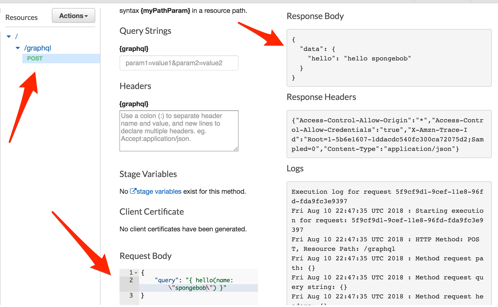
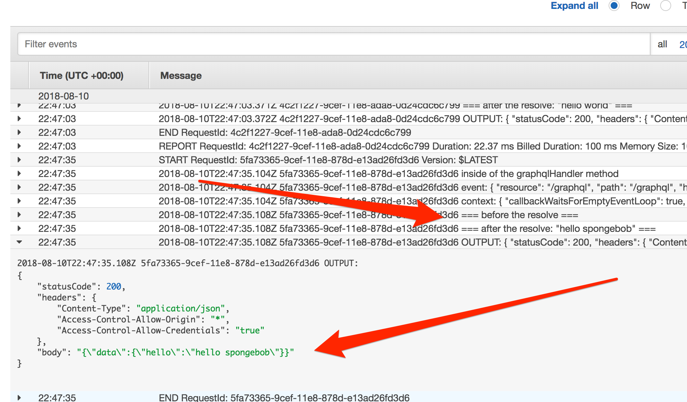

# serverless-lambda-graphql

example of a graphql server hosted on aws lambda that uses graphql-middleware.

```
git clone git@github.com:jbastias/serverless-lambda-graphql.git

cd serverless-lambda-graphql

npm install

npm run transpile

serverless deploy

```

### test on AWS

`api-gateway`:

- api: `dev-test-serverless-lambda-graphql` 
- resources: `/graphql`
- method: `POST`
- body: `{ "query": "{ hello(name: \"spongebob\") }" }`




`cloudwatch`:

- log: `/aws/lambda/test-serverless-lambda-graphql-dev-graphqlHandler` 



### resources
- [aws](https://aws.amazon.com/)
- [serverless](https://serverless.com/)
- [apollo](https://www.apollographql.com/)
- [graphql-middleware](https://github.com/prismagraphql/graphql-middleware)